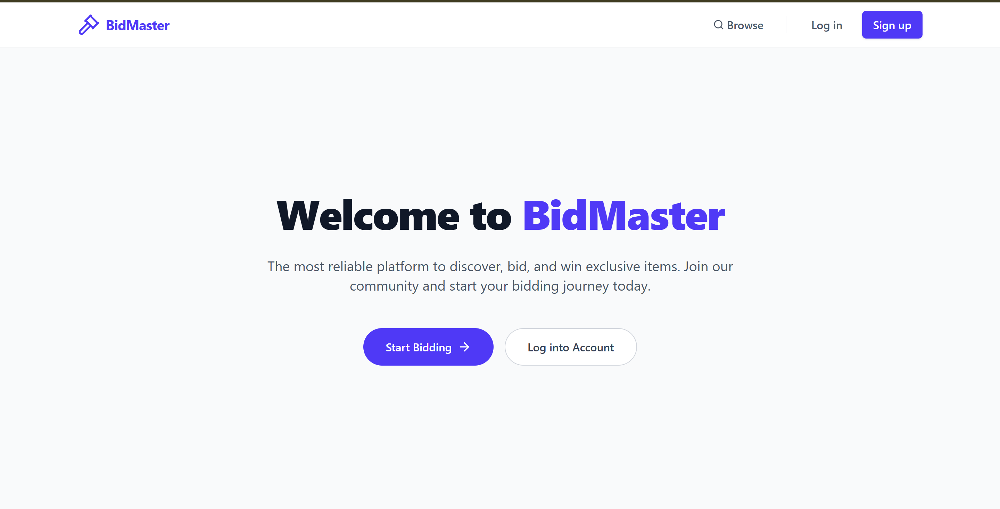
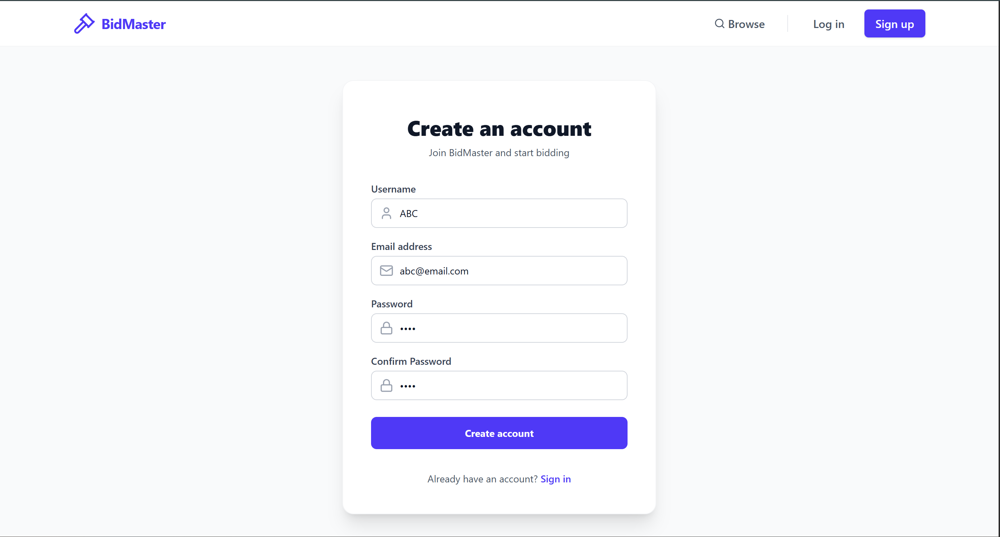
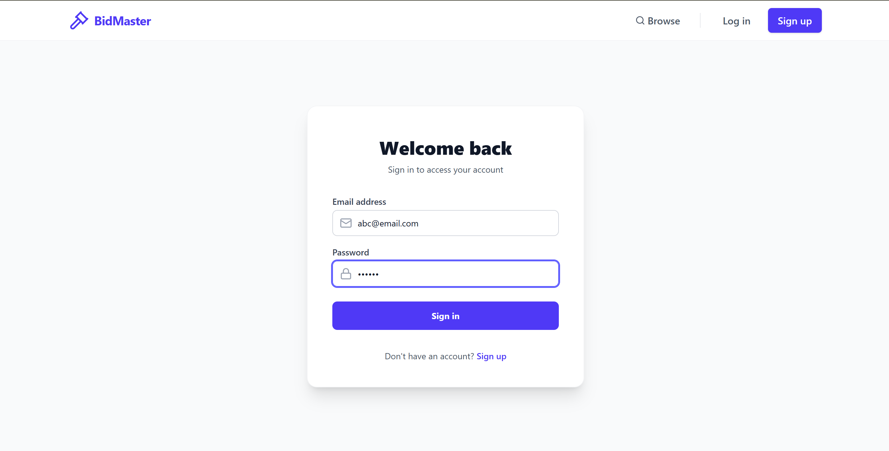
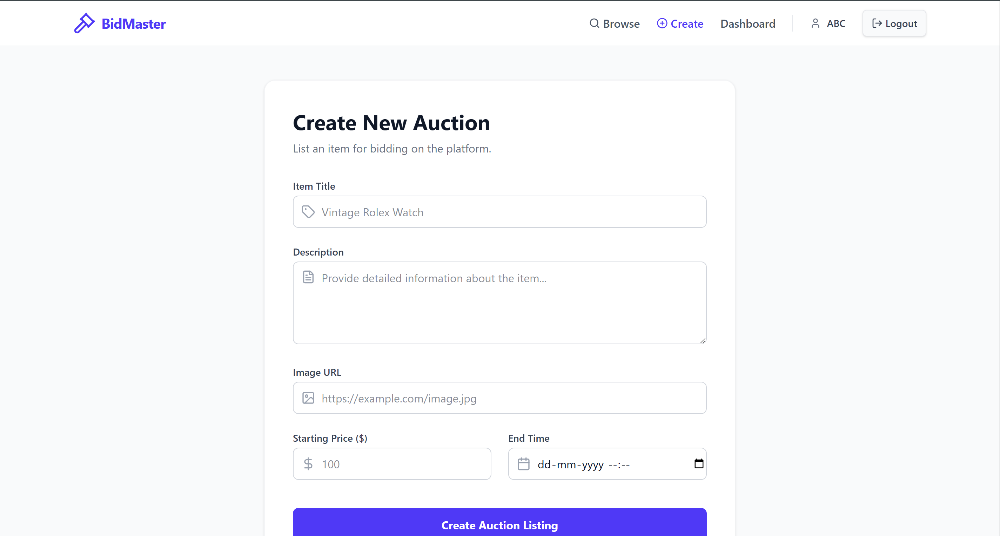
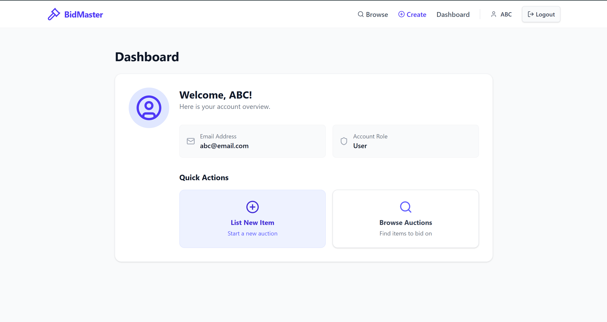

# BidMaster - Online Auction Platform

BidMaster is a full-featured, robust, and highly responsive MERN-stack web application designed to facilitate real-time online auctions. It provides a secure, intuitive environment for buyers and sellers to interact, list items, and participate in competitive bidding. Additionally, it offers a dedicated, comprehensive administration dashboard for managing user accounts, listings, and bid history.

<p align="center">
  
</p>

---

## Table of Contents

- [Architecture Overview](#architecture-overview)
- [Key Features](#key-features)
- [Technology Stack](#technology-stack)
  - [Frontend](#frontend)
  - [Backend](#backend)
  - [Database](#database)
- [Directory Structure](#directory-structure)
- [Database Schema & Models](#database-schema--models)
  - [User Model](#user-model)
  - [Auction Model](#auction-model)
  - [Bid Model](#bid-model)
- [API Endpoints Documentation](#api-endpoints-documentation)
  - [Authentication (`/api/auth`)](#authentication-apiauth)
  - [Auctions (`/api/auctions`)](#auctions-apiauctions)
  - [Bidding (`/api/bids`)](#bidding-apibids)
  - [Admin Dashboard (`/api/admin`)](#admin-dashboard-apiadmin)
- [Environment Configuration](#environment-configuration)
- [Installation & Development Setup](#installation--development-setup)
  - [Prerequisites](#prerequisites)
  - [Step 1: Clone the Repository](#step-1-clone-the-repository)
  - [Step 2: Configure Backend Environment Variables](#step-2-configure-backend-environment-variables)
  - [Step 3: Start the Backend Server](#step-3-start-the-backend-server)
  - [Step 4: Start the Frontend Application](#step-4-start-the-frontend-application)
- [Production Build](#production-build)
- [License](#license)
- [Authors](#authors)

---

## Architecture Overview

BidMaster utilizes a decoupled client-server architecture consisting of:
1. **Frontend Client**: A single-page application (SPA) built with React, Vite, and Tailwind CSS. It communicates with the server asynchronously via Axios.
2. **Backend Server**: An Express.js application running on Node.js that serves as a RESTful JSON API.
3. **Database Server**: MongoDB, structured through Mongoose schemas to store and query relational-like documents (such as linking Bids and Auctions to Users) efficiently.

Authentication is handled securely using JSON Web Tokens (JWT) stored client-side and verified server-side through middleware layers.

---

## Key Features

### 1. User & Identity Management
- **Secure Registration & Login**: Integrated password hashing with bcryptjs.
- **Token-based Authentication**: JWT-based session security with an expiration period of 30 days.
- **Route Authorization**: Dedicated frontend component wrappers (`ProtectedRoute`, `AdminProtectedRoute`) and backend middlewares to enforce route access restrictions.

<p align="center">
  
  
</p>

### 2. Auction Platform
- **Interactive Listings**: Browse active, upcoming, or completed auctions with responsive grids.
- **Creation & Management**: Authenticated sellers can create listings with detailed titles, descriptions, starting prices (base price), and end dates.
- **Image Integration**: Fallback image handler with support for custom image URLs.

<p align="center">
  
</p>

### 3. Real-Time Bidding
- **Validation Engine**: Automated backend checks to ensure bid amounts exceed both the starting price and current highest bid.
- **History Tracking**: Keeps a historic ledger of bids per auction, indicating bidder details, timestamps, and bid amounts.

<p align="center">
  
</p>

### 4. Admin Administration
- **Global Statistics Dashboard**: View live operational stats including total registered users, total active auctions, and bid frequency.
- **User Moderation**: View all users and delete problematic accounts safely.
- **Auction & Bid Moderation**: Administrative access to edit, delete, or override any active auction or individual bid.

---

## Technology Stack

### Frontend
- **React 19**: Modern declarative UI library.
- **Vite 8**: Rapid, optimized build tool.
- **Tailwind CSS 4**: Utility-first styling engine with native CSS variables.
- **React Router DOM 7**: Client-side declarative routing.
- **Lucide React**: Clean vector iconography.
- **React Hot Toast**: Beautiful notification overlays.

### Backend
- **Node.js**: Asynchronous event-driven Javascript runtime.
- **Express 5**: Fast, minimal web framework.
- **Bcrypt.js**: High-security password hashing library.
- **JSONWebToken (JWT)**: Secure identity payload exchange.
- **Cors**: Cross-origin resource sharing controls.

### Database
- **MongoDB**: Highly scalable document database.
- **Mongoose 9**: Object Data Modeling (ODM) library for schema enforcement and validation.

---

## Directory Structure

```text
Auction-Application/
├── Auction_project/
│   └── mern-auction-app/
│       ├── backend/
│       │   ├── config/             # Database connection utilities
│       │   ├── controllers/        # Route controller implementations (business logic)
│       │   ├── middlewares/        # Authentication & admin filters
│       │   ├── models/             # Mongoose schemas (User, Auction, Bid)
│       │   ├── routes/             # Express routing paths
│       │   ├── utils/              # Helper utilities (e.g., Token generator)
│       │   ├── package.json        # Backend metadata and dependencies
│       │   └── server.js           # Server entry point
│       └── frontend/
│           ├── public/             # Static public assets
│           ├── src/
│           │   ├── assets/         # App-specific UI assets
│           │   ├── components/     # Reusable layout & state wrappers
│           │   ├── context/        # React Context (Auth State management)
│           │   ├── pages/          # Page views (Home, Browse, Dashboards)
│           │   ├── services/       # API call connectors (Axios)
│           │   ├── App.jsx         # App routes mapping & core component
│           │   ├── main.jsx        # Frontend entry point
│           │   └── index.css       # Global styles imports
│           ├── package.json        # Frontend metadata and dependencies
│           └── vite.config.js      # Vite dev settings & plugins
└── README.md                       # Root documentation (this file)
```

---

## Database Schema & Models

### User Model
Stored in the `users` collection.
- **username**: `String` (Required)
- **email**: `String` (Required, Unique, Indexed)
- **password**: `String` (Required, Hashed using salt rounds of 10)
- **role**: `String` (Enum: `['user', 'admin']`, Default: `'user'`)
- **timestamps**: `createdAt`, `updatedAt`

### Auction Model
Stored in the `auctions` collection.
- **title**: `String` (Required, Trimmed)
- **description**: `String` (Required)
- **image**: `String` (Default placeholder URL provided)
- **basePrice**: `Number` (Required, Min: 0)
- **currentBid**: `Number` (Default: 0)
- **seller**: `ObjectId` (Required, References `User`)
- **startTime**: `Date` (Default: `Date.now`)
- **endTime**: `Date` (Required)
- **status**: `String` (Enum: `['active', 'ended', 'cancelled']`, Default: `'active'`)
- **winner**: `ObjectId` (References `User`, populated on auction end)
- **timestamps**: `createdAt`, `updatedAt`

### Bid Model
Stored in the `bids` collection.
- **auction**: `ObjectId` (Required, References `Auction`)
- **bidder**: `ObjectId` (Required, References `User`)
- **amount**: `Number` (Required)
- **timestamps**: `createdAt`, `updatedAt`

---

## API Endpoints Documentation

### Authentication (`/api/auth`)

| HTTP Method | Endpoint | Description | Authentication |
| :--- | :--- | :--- | :--- |
| **POST** | `/api/auth/register` | Register a new user | Public |
| **POST** | `/api/auth/login` | Login user and retrieve JWT | Public |
| **GET** | `/api/auth/profile` | Retrieve profile of current authenticated user | Protected (JWT) |

### Auctions (`/api/auctions`)

| HTTP Method | Endpoint | Description | Authentication |
| :--- | :--- | :--- | :--- |
| **GET** | `/api/auctions` | Get all active auctions | Public |
| **POST** | `/api/auctions` | Create a new auction | Protected (JWT) |
| **GET** | `/api/auctions/:id` | Get details of a single auction | Public |
| **PUT** | `/api/auctions/:id` | Update auction details | Protected (Seller only) |
| **DELETE** | `/api/auctions/:id` | Delete an auction listing | Protected (Seller or Admin) |

### Bidding (`/api/bids`)

| HTTP Method | Endpoint | Description | Authentication |
| :--- | :--- | :--- | :--- |
| **POST** | `/api/bids/:auctionId` | Place a bid on a specific auction | Protected (JWT) |

### Admin Dashboard (`/api/admin`)

| HTTP Method | Endpoint | Description | Authentication |
| :--- | :--- | :--- | :--- |
| **GET** | `/api/admin/users` | Retrieve list of all users | Admin Protected |
| **DELETE** | `/api/admin/users/:userId` | Delete a user account | Admin Protected |
| **GET** | `/api/admin/auctions` | Retrieve all platform auctions | Admin Protected |
| **DELETE** | `/api/admin/auctions/:auctionId` | Administrative deletion of an auction | Admin Protected |
| **GET** | `/api/admin/bids` | Retrieve list of all bids | Admin Protected |
| **GET** | `/api/admin/statistics` | Retrieve analytical platform insights | Admin Protected |

---

## Environment Configuration

A configuration `.env` file must be created inside the `Auction_project/mern-auction-app/backend/` directory to configure database credentials and authorization key signatures:

```env
# Server Port Configuration
PORT=5000

# Environment Mode
NODE_ENV=development

# MongoDB Connection String (Atlas URI or Local URI)
MONGO_URI=mongodb+srv://<username>:<password>@cluster.mongodb.net/bidmaster?retryWrites=true&w=majority

# JWT Token Secret
JWT_SECRET=your_super_secure_jwt_secret_phrase
```

---

## Installation & Development Setup

### Prerequisites
Make sure you have the following installed on your machine:
- **Node.js** (v18.0.0 or later recommended)
- **npm** (v9.0.0 or later)
- **MongoDB Database** (MongoDB Atlas cluster or a locally running instance)

---

### Step 1: Clone the Repository
Navigate to your desired directory and clone the repository locally:
```bash
git clone https://github.com/OMKEERTHANA/Auction-Application.git
cd Auction-Application
```

### Step 2: Configure Backend Environment Variables
1. Navigate to the backend directory:
   ```bash
   cd Auction_project/mern-auction-app/backend
   ```
2. Create a new `.env` file:
   ```bash
   # On Windows (PowerShell)
   New-Item .env
   ```
3. Copy the template from the [Environment Configuration](#environment-configuration) section and update it with your connection URI and secret keys.

### Step 3: Start the Backend Server
1. From the backend folder, install all required backend dependencies:
   ```bash
   npm install
   ```
2. Start the development server using Node:
   ```bash
   node server.js
   ```
   *(Alternatively, if you have `nodemon` installed globally or as a dev-dependency, run: `npx nodemon server.js`)*

### Step 4: Start the Frontend Application
1. Open a new terminal and navigate to the frontend directory:
   ```bash
   cd Auction_project/mern-auction-app/frontend
   ```
2. Install all frontend dependencies:
   ```bash
   npm install
   ```
3. Run the client-side development server:
   ```bash
   npm run dev
   ```
4. Once started, open your web browser and navigate to the local address displayed (typically `http://localhost:5173`).

---

## Production Build

To build the frontend project for production:
1. Navigate to the frontend directory:
   ```bash
   cd Auction_project/mern-auction-app/frontend
   ```
2. Execute the build command:
   ```bash
   npm run build
   ```
This generates a static assets directory (`dist/`) that can be served via static file servers, Nginx, or integrated directly with the Node/Express backend.

---

## License

Distributed under the **ISC License**. See standard license agreements for further legal permissions.

---

## Authors

- **Soumitha** 
